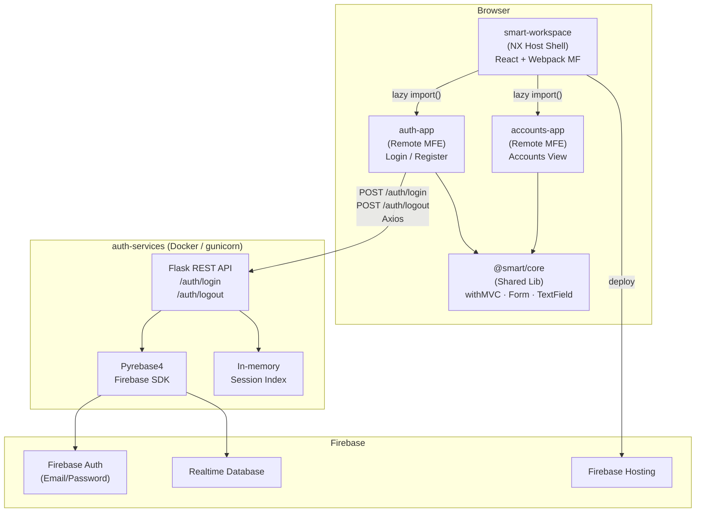
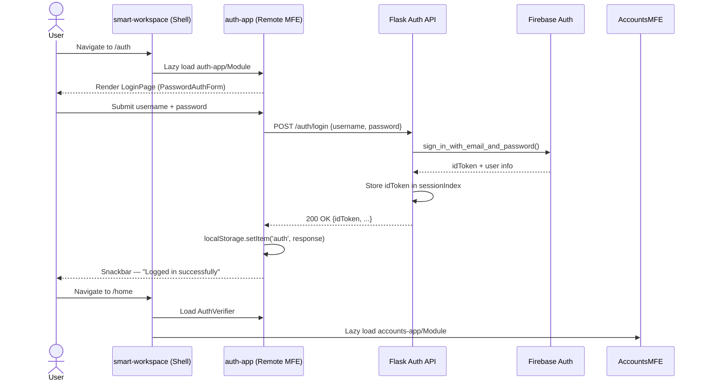
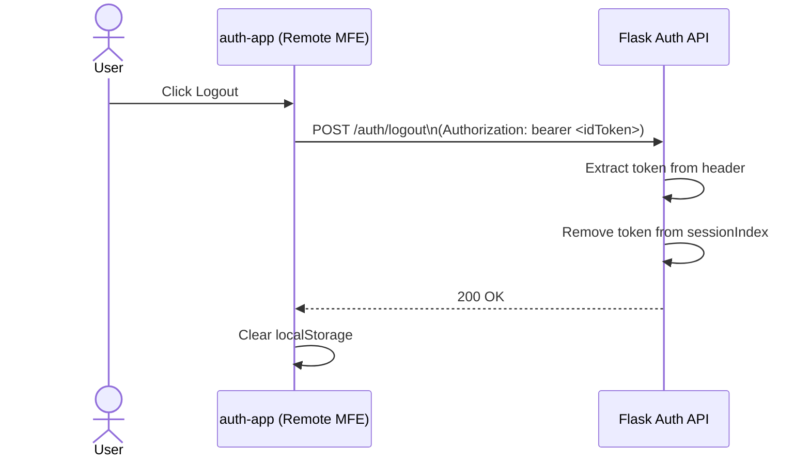
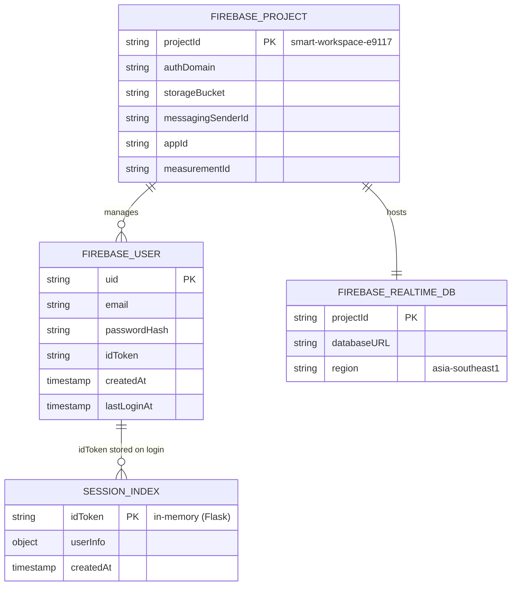
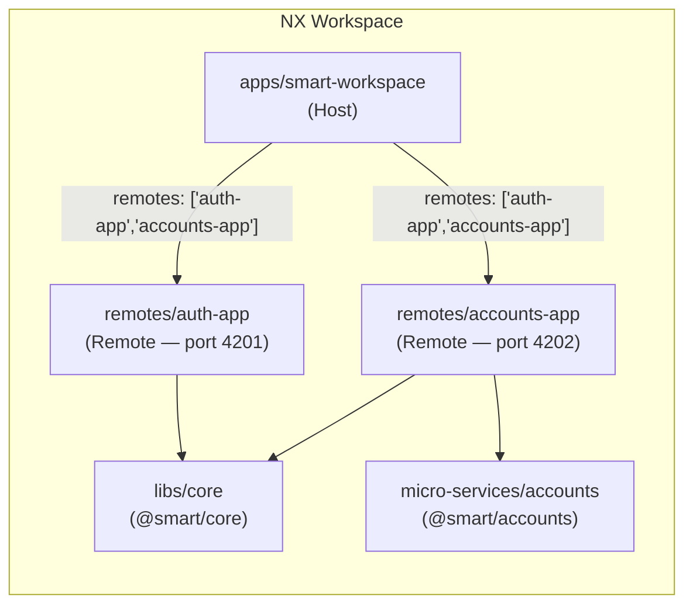

# Smart Workspace

> A unified micro-frontend portal that aggregates multiple applications under a single shell, with Firebase-backed authentication served via a Python Flask REST API.

---

## Tech Stack

| Layer | Technology |
|---|---|
| Frontend Shell | React 18, TypeScript, NX Monorepo, Webpack Module Federation |
| Remote MFEs | auth-app, accounts-app (lazy-loaded remotes) |
| Shared Library | @smart/core — withMVC pattern, Form, TextField, Button |
| State / Forms | react-hook-form, RxJS |
| UI Components | MUI v5, Emotion, Framer Motion, Notistack |
| Auth Backend | Python 3.11, Flask 3, Flask-RESTful, Flask-CORS |
| Auth Provider | Firebase (Pyrebase4) — Email/Password Auth, Realtime DB |
| Hosting | Firebase Hosting + Emulators |
| Containerisation | Docker (gunicorn) |
| Testing | Jest, Vitest, Cypress E2E |
| Tooling | NX 17, pnpm, ESLint, Prettier, SWC |

---

## Architecture Diagram



---

## Sequence Diagram — Login Flow



---

## Sequence Diagram — Logout Flow



---

## Database / Firebase ER Diagram



---

## NX Module Federation Map



---

## Project Structure

```
Smart-Workspace/
├── auth-services/          # Python Flask REST API (Docker)
│   └── app/
│       ├── config/         # EnvConfig (firebase keys)
│       ├── db/             # Pyrebase init, session store
│       ├── views/          # /auth/login, /auth/logout
│       ├── utils/          # AuthUtils, StatusGenerator
│       └── models/         # Constants (routes, methods)
└── ui-services/            # NX Monorepo
    ├── apps/smart-workspace/   # Host shell (MF entry)
    ├── remotes/
    │   ├── auth-app/           # Login/Register MFE
    │   └── accounts-app/       # Accounts MFE
    ├── libs/core/              # Shared: withMVC, Form, TextField
    └── micro-services/accounts/ # Accounts component library
```
